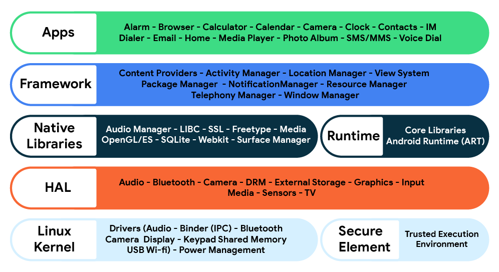

# 第一章 引言

## 1.1 AOSP是什么

​	AOSP的全称是“Android Open Source Project”，也就是安卓开源项目。由谷歌发起的移动设备的操作系统。任何人都可以自由的获取到完整的项目源码，以及提交更新完善项目，同时，谷歌也会不断的迭代更新版本。

​	由于Android的开源，各大手机厂商能能够自由的定制系统的源码，适配自己的硬件，由此衍生出了各种产品。我们常见的国产安卓设备的系统，基本厂商开发团队基于AOSP源码不断进行改造和优化的结果，例如小米MIUI系统、华为Harmony的系统、一加的H2OS系统等等，大多数都是基于AOSP的源码修改而来。如今的Android能够百花齐放，占据手机市场的半壁江山，也是主要得益于AOSP的开源。

​	由于AOSP项目过于庞大和复杂，所以我们在了解和学习的过程中，要善于查询官方的说明文档。Android官方文档地址: [https://source.android.com](https://source.android.com)

下图是官方文档中的AOSP的框架结构图。



​	对于新手而言，刚开始接触安卓源码时，对于很多基础理论性的知识都是懵懵懂懂的。这些基础并不需要我们完全的记住，只需要大概有这么一个概念，以及了解它们之间依赖关系的印象即可，等以后实践多了，再过头看这部分内容，温故一下理论部分，就会茅塞顿开了。

​	Apps就是我们日常开发的应用层，我们使用手机日常安装的应用，游戏等等都属于这一层，普通应用基本都在手机的目录`/data/app`中。包括AOSP提供的系统APP，也是属于应用层。例如相机、短信、图库，在`/system/app`目录下的应用。应用层直接对接用户的输入操作和输出展示。这里的输入指的是，我们对手机进行的操作，例如点击屏幕，手机上的按键，所有我们对手机进行的操作行为，统称为一种输入。而输出指的是，手机接收到我们的输入行为后的一种反馈，例如屏幕亮了，页面刷新等等所有通过手机展示给你看到的，都算是手机的输出。

​	Framework框架层。这里简单介绍一下框架的概念，在我们开发中，很多功能是多数开发人员所共同需求的基础功能，这些功能是作为一个智能手机系统所必备的基础部分，例如查询sim卡信息，跨进程的通信，窗口的管理等等，这个部分就是框架，由基础组建而成的摩天大楼。普通应用就像是这栋大楼的住户，所以和应用打交道最多的就是基础功能，为我们提供在开发应用时所用到的API和组件支持。如果你是一名安卓开发人员，相信这里是你在开发中接触最多的部分。下面简单列举几个框架层中的关键组件。

1. **Activity Manager**是Android最核心的部分，它负责了系统中四大组件的启动、调度、管理。所有的Activity的生命周期都是在它的范畴。

2. **Location Manager**位置信息和定位的管理组件

3. **Telephony Manager**电话管理组件，可以获取sim卡相关信息以及网络信息

4. **Window Manager**窗口程序管理组件

​	当应用层调用管理组件后，管理组件会进而调用对应的Service来执行相应的函数。简单来说就是XXX Manager基本是提供给应用层调用，真正的处理逻辑是在XXX Service中处理。如下图所示：


​	同时我们也可以更直观的去看framework的实现，连接手机。将jar文件传到电脑

```
adb shell
cp /system/framework/framework.jar /sdcard/
adb pull /sdcard/framework.jar ./
```

​	然后使用jadx打开将`framework.jar`文件，如下图所示：


5. **Native Libraries**。字面意思，C/C++库的原生支持库，比如比较典型的libc、ssl、opengl等等。

6. **Android Runtime**。安卓的运行时库，安卓中最核心的ART虚拟机就是在这个部分。虽然android开发常常使用的是java，但是android开发的应用并不是运行在JVM虚拟机中，而是类似的针对dex结构的Dalvik虚拟机和ART虚拟机。在android4.4之后，逐渐使用ART虚拟机全面替代了Dalvik虚拟机。

7. **HAL硬件抽象层**。主要作用于系统内核与硬件之间的接口，具有提供给硬件供应商实现的标准接口。往往用来做硬件的驱动程序开发。也有个说法是因为硬件供应商不愿意自身的驱动放在内核中被一起开源。所以单独抽出了HAL层来对接硬件驱动。

8. **Linux内核**。系统的最重要的核心部分，内核负责与设备底层的硬件进行交互。比如显示驱动、音频驱动、WIFI驱动、电源驱动、内存管理、进程管理等等。


## 1.2 系统开发，定制，刷机，改机分别是什么

​		在正式开始学习前，我们需要先了解一下这些常常出现的关键词基本的含义。

### 1.2.1 系统开发

​	我们常规的android开发，属于应用层开发。而在开发应用层时，会接触到大量的系统提供的api，为我们获取权限，跨进程通信，网络请求等功能提供了便利。并且我们运行的app整个生存周期都是寄托于系统环境中。作为开发人员，我们往往最多面对的问题就是，系统给你提供了哪些功能，系统允许了你哪些权限范围。但是并不代表着，系统能满足所有群体的所有需求。这个时候就需要了解android系统架构，根据我们自己的需求，去添加功能提供接口给我们应用层开发的app使用。

​	非常常见的一个场景就是，AOSP是谷歌开源的系统，而谷歌的开发者并不一定了解其他国家的国情，用户的习惯。那么国内的厂商进行系统开发扩展功能，就需要考虑到国内用户体验，对界面，操作方式，系统服务等一些功能进行开发。

### 1.2.2 系统定制

​	系统定制也是属于系统开发的一种，属于轻量级的改动。往往不会对系统进行太大的变动。比如下面的场景。系统就像是一个沙箱，而我们开发的应用是在沙箱中运作的小盒子。而我们需要对应用进行分析和观测时，可以通过修改小盒子运行流程时对系统相关的调用，来分析应用执行的各种状态。只要我们对android系统有足够的了解，就可以像开了上帝视角一般，对普通应用进行跨维度的分析。

### 1.2.3 刷机

​	在最早先的Android版本界面非常简陋，而且功能并不是那么完善，随着各大第三方团队的加入，非官方ROM越来越多，而官方原版ROM长久使用后越来越卡，善于折腾的手机用户就开始尝试使用功能相对完善，界面漂亮，性能更好的第三方ROM。更换ROM的过程就叫做刷机。当然我们并不是直接刷第三方提供的ROM包，而是自己编译一个ROM，再刷入手机。

​	当系统修改完成，编译成ROM镜像后，我们就需要将镜像刷入测试设备中，测试我们修改的系统功能是否正常运转。常见的刷机流程是卡刷和线刷。

​	线刷指的是刷机时候需要用数据线连接电脑，将线刷包通过数据线方式刷放设备。这里，刷机用到的系统镜像称为“线刷包”。线刷包一般都是分区镜像img后缀的文件。通过执行命令`adb reboot bootloader`，进入设备刷机模式后，然后执行`fastboot flash`命令，刷入对应分区的镜像。而AOSP编译完成后在输出目录拿到的就是分区镜像。

​	卡刷指的是刷机过程不需要使用数据线连接电脑，而是将设备启动进入恢复模式，在该模式下，将放在设备上的刷机镜像直接刷入设备。卡刷包一般是一个zip格式的压缩包文件。目前，比较流行的第三方设备恢复镜像是TWRP。刷机流程一般是先刷入TWRP，然后将卡刷包传入手机sdcard中。再用TWRP的命令功能刷入镜像。第三方常见的ROM，比如魔趣、lineageOS、PixelExperience等系统，ROM编译完成后，输出目录的就是卡刷包。

### 1.2.4 改机

​	每个设备都有各自的唯一标识和对应的指纹信息。这里的指纹信息，并不是指手指的指纹，而是一个概念的意思。比如每个人指纹不同，是因为手指有很多细微的纹路，纹路都组合在一起时，就会每个人的都不同了。设备也是如此，有很多种设备信息，当这些设备信息组合在一起时，就可以当作是这台设备唯一标识的指纹特征。

​	在风控对抗中，有些应用会收集设备的各种信息组合为设备指纹，记录起来。有些设备信息是属于风险设备，就会被特殊处理。而我们自己定制的AOSP，以及谷歌天然支持的Pixel手机，就很容易被判定为高风险设备。所以我们自己编译的ROM常常会碰到被检测的情况，识别到属于风险设备后，就可能导致app闪退，或者不给正确的结果，或者服务端标记为风险用户等等情况。这时我们就需要对获取设备信息的各个接口进行修改，或者直接将设备信息相关的文件修改，伪装成一台正常的手机。有时应用并不会通过系统接口来获取设备指纹，而是直接通过系统目录，或者将系统文件结构作为设备信息，或者是绕过你的修改，通过底层内联汇编执行系统调用，来读取文件获取你的设备信息，这种情况就需要分析和持续的对抗了。

## 1.3 安卓系统发展史

​	2003年由安迪.鲁宾、克里斯.怀特等人开发制作。最初方向只是创建一个数字相机的操作系统，后来由于数码相机市场的萎缩，智能手机的快速发展，最后重新将安卓定位为开发一款智能手机操作系统。于2005年7月11日被Google收购。

​	2007年11月，Google牵头联合了硬件制造商，软件开发商，通讯运营商成立了“开放手机联盟”，共同研发Android，随后开放了Android源码。11月5日，Android1.0公测版面世

​	2008年9月，发布了第一款安卓智能机：HTC Dream，这个时候还是诺基亚塞班系统的天下，这是时候并没有多少人看好Android系统。

​	2010年末，刚出世两年的Android操作系统在市场占有率上打败了塞班系统。这时的Android2.3版本

​	2011年10月，Android4.0发布，首次支持通过使用照相机拍摄用户的脸部来解锁手机

​		2014年，Android5.0发布，这是第一个使用Google全新Material Design语言的版本，用户操作界面和UI的外挂得到了升级。同时加上了对双SIM卡的支持。

​		2016年，Android7.0发布，改用新的JIT编译器加快应用的运行速度。

​		2017年，Android全球网络流量和设备超越微软的Window，正式成为全球第一大操作系统。


## 1.4 其他常见的第三方定制系统

​		AOSP并不是唯一可以定制的ROM，同样有很多优秀的第三方团队研发的定制系统。由于AOSP基本只对Google系的机型适配，所以有使用国内常见测试机的人一般会选择使用第三方的定制ROM，这些第三方开源ROM都有着各自的优点，有很多人会直接选择在这些已经定制修改过ROM上二次开发，对于我们学习来说，选择哪个ROM的区别并不会太大，因为底层一套使用的AOSP这一套，所以我们只要摸透一款，做好的功能随时可以迁移到其他的系统上。

### 1.4.1 Mokee

​		官网：https://www.mokeedev.com/

​		中文名魔趣，。发起于2012年12月12日，是国内最大的第三方非盈利性开源ROM，适配了大量国内主流机型，高达近300种。主要针对的用户群体也是国内群众，所以在功能和操作方面非常贴切国人的使用习惯，同时简单纯净，性能出众，所以有些人会使用魔趣作为日常用的手机。下面是魔趣支持的手机厂商，

| ARK  | 华硕 | Essential | 谷歌 |
| :--: | :--: | :-------: | :--: |
| HTC  | 华为 | 乐视 | 联想 |
| LG   | 魅族 | 摩托罗拉 | Nextbit |
| 努比亚 | 一加 | OPPO | Realme |
| 红米 | 三星 | 锤子 | 索尼 |
| Wileyfox | 小米 | YU   | 中兴 |
| ZUK  |      |      |      |

​	如果想要进一步了解，可以看看魔趣为AOSP扩展的功能 [https://www.mokeedev.com/guide/feature.html](https://www.mokeedev.com/guide/feature.html)。


### 1.4.2 PixelExperience

​		官网：https://download.pixelexperience.org/

​		这是最接近原生Android系统的第三方ROM,，我们正常编译出来的AOSP刷入后是没有谷歌插件，并且界面UI都是非常简陋的。如果你想要打造一个和原生Android非常相似的ROM，那么完全可以选择它，原生Android的界面风格以及自带谷歌套装，以及适配了更多的手机厂商。下面是它所支持的各大厂商。

|  ASUS  | Google  |  Lenovo  | Motorola |
| :----: | :-----: | :------: | :------: |
| Nokia  |  Nubia  | OnePlus  |  Razer   |
| Realme | Samsung | Teracube |  Xiaomi  |


### 1.4.3 LineageOS

​		官网：https://www.lineageos.org/

​		LineageOS的前身是大名鼎鼎的CyanogenMod，简称CM，这个开发团队是全球最大的Android第三方编译团队。早在Android1.6版本时，就为很多手机厂商定制出稳定的ROM。2016年12月Cyanogen公司宣布停止开发并关闭项目，随后复刻后更名为LineageOS由原团队继续研发。 LineageOS的风格同样是类似原生Android的，但是相比起PixelExperience要更加的精简，运行起来也是非常流畅，同样适配各大厂商机型。下面是它所支持的各大厂商。

|   ASUS    |   BQ    | Dynalink | Essential |
| :-------: | :-----: | :------: | :-------: |
| Fairphone |  FxTec  |  Google  |   LeEco   |
|  Lenovo   |   LG    | Motorola |  Nextbit  |
|   Nokia   |  Nubia  |  Nvidia  |  OnePlus  |
|   Razer   | Samsung |  SHIFT   |   Sony    |
|  Xiaomi   |   Zuk   |  Extras  |           |


## 1.5 初识系统定制

​		除了各大知名团队的开源ROM，也有一些深入了解安卓原理的开发人员会自己修改ROM定制自己的专属工具，亦或者为团队定制专用的功能。不过定制并不是能解决所有问题，我们要了解定制的优点和缺点，在各种需求场景采用更合适的方案。

### 1.5.1 系统定制的优点

​		学习系统定制的好处是非常多的，这里我简单列举几点。

1、我们可以通过源码的阅读，深入了解Android设计的原理，对异常错误排查，性能优化，以及应用提权等等开发应用层的程序也会得心应手。

2、从逆向的角度看，依托在系统下运行的应用，我们可以直接通过对ROM的修改，就能轻松获取到任何执行环节所使用的数据。如同游戏开外挂一般的降维打击。

3、同时我们也可以自己打造喜欢的日常用机。为自己DIY一些提供便利的小功能，或者打造自己专用的工具手机。

### 1.5.2 系统定制的缺点

​		定制的优势有的时候同样也代表着缺点，杀鸡用牛刀可以非常形象的形容我们定制ROM来干的事情。因为有很多时候，一些需求并不需要修改ROM，就能用其他方案轻松做到的，下面简单的总结几个缺点。

1、学习难度大，刚开始的阶段，搭建编译ROM的环境就较为麻烦，再加上庞大的源代码，复杂的结构，所以很容易劝退一些初学者。

2、开发成本大，每次修改完代码都需要重新刷机，很多时候哪怕做一个小小的功能，你在测试的过程都在无限的重复编译刷机。

3、维护成本大，即使是一个成型的产品后续难免会有优化和更新，BUG是不可能没有的。而我们想要更新，只能选择全部重新刷机。


### 1.5.3 系统定制的发展趋势

​

### 1.6 初识系统刷机


## 1.7 小结

