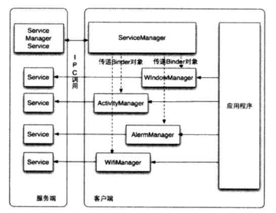
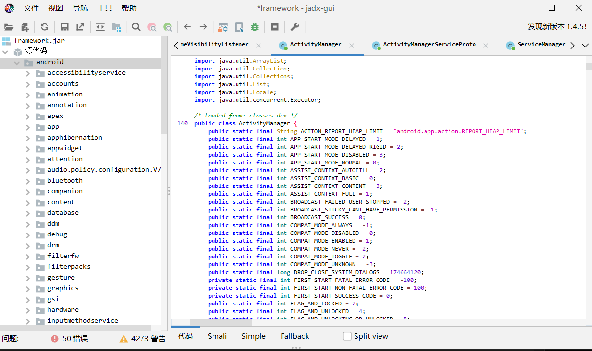

# 第1章 引言

​	`Android`系统是一款开源的移动设备操作系统，任何个人与组织都能轻易从网络上获取它的源码，编译修改并刷写到自己的设备上，这种独特的魅力吸引了众多的商业公司与开源社区，来自全球的开发测试与玩机人员，孜孜不倦的为其修正添加与测试系统功能。经历数十载发展，如今的`Android`不单只应用于手机市场，还有许多智能设备也是使用的`Android`系统来驱动，例如智能电视、机顶盒、车载娱乐系统、智能手表、智能家居等等，由于`Android`系统的灵活性和开放性，让其可定制性在各类设备中得到充分的利用。开发者可以根据自身业务的需求，自由的改造`Android`系统。

本书内容将围绕着系统的编译修改、美化、安全分析增强等众多应用场景，讲解在`Android`系统实际开发定制过程中的一些技巧。由于国内用户时常将`Android`称为安卓，因此，本书后面部分讲解，内容描述中遇到`Android`与安卓，表述的都是同一个概念。

在这一章中，将简单的介绍`Android`系统和定制。通过这一章的学习，让读者对于`Android`系统中的常见名词有一个基本的了解。

## 1.1 AOSP是什么

​	`Android`操作系统是如今最流行、使用最广泛的智能手机操作系统。它的发展受到广大手机厂商和用户的支持，而`Android`操作系统的开源使它可以被任何人定制化，从而满足各类厂商和不同需求的用户。

​	`AOSP`的全称是`“Android Open Source Project”`，也就是安卓开源项目，它是由谷歌发起的移动设备的操作系统开源项目，任何人都可以自由地获取完整的项目源码，以及提交更新完善项目，同时，谷歌也会不断地迭代更新版本。

​	由于`Android`的开源，各大手机厂商能能够自由地定制系统的源码，适配自己的硬件，由此衍生出了各种产品。常见的国产安卓设备的系统基本是厂商开发团队基于`AOSP`源码不断进行改造和优化的结果，例如小米`MIUI`系统、华为`Harmony`系统、一加的`H2OS`系统等等，大多数都是基于`AOSP`的源码修改而来。如今的`Android`能够百花齐放，占据手机市场的半壁江山，也是主要得益于`AOSP`的开源。

​	由于`AOSP`项目过于庞大和复杂，在了解和学习的过程中，要善于查询官方的说明文档。`Android`官方文档地址: [https://source.android.com](https://source.android.com)

​	下图是官方文档中的`AOSP`的框架结构图。


### 1.1.1 Android框架

​	对于新手而言，刚开始接触安卓源码时，对于很多基础理论性的知识都是懵懵懂懂的。这些基础并不需要完全的记住，只需要大概有这么一个概念，以及了解它们之间依赖关系的印象即可，等熟悉`Android`源码后，大多数理论知识部分，就会茅塞顿开了。

​	简单介绍一下框架的概念，框架是一种软件开发的基础结构，它提供了一组标准化的、可重用的代码和工具，帮助开发者更加高效地开发应用程序。通常，框架包括一些约定、规则和指南，以及可以被开发者扩展的可插入的模块。

​	框架的设计目的是简化开发过程，提高代码的可维护性和可扩展性，并促进开发人员之间的协作。通过使用框架，开发人员可以专注于业务逻辑而不必处理底层的实现细节，从而减少开发时间和成本，同时也能够降低代码错误率和风险。常见的框架有`Web`框架、移动应用框架、游戏引擎框架等。下面简单介绍`Android`框架的结构。

### 1.1.2 Apps

​	`Apps`是日常开发的应用层，用户安装的应用与游戏等等都属于这一层，普通应用基本都在手机的目录`/data/app`中。包括`AOSP`提供的系统`APP`，也属于应用层。例如相机、短信、图库，在`/system/app`目录下的应用。应用层直接对接用户的输入操作和输出展示。这里的输入指的是，对手机进行的操作，例如点击屏幕，手机上的按键，所有对手机进行的操作行为，统称为一种输入。而输出指的是，手机接收到输入行为后的一种反馈，例如屏幕亮了，手机震动，页面刷新等等所有通过手机展示给你看到的，都算是手机的输出。

### 1.1.3 Framework

​	`Framework`框架指的是包含了大量系统级服务和`API`的软件层。它位于操作系统内核（Linux）和应用程序之间，提供了一组通用的、可重用的软件组件，以方便开发者构建各种类型的应用程序。下面简单列举几个框架层中的关键组件。

​	`Framework`框架被设计成一个分层架构，包含多个组件，如`Activity Manager、Window Manager`等。这些组件与应用程序和硬件之间进行交互，并提供了许多通用功能，如界面管理、数据存储、网络通信等。

​	通过使用`Framework`框架，开发人员可以快速地编写复杂的应用程序，并在不同设备上运行，同时也能够轻松地处理常见的`Android`应用程序逻辑。此外，由于`Framework`框架的广泛使用，它还为第三方开发者提供了良好的兼容性和稳定性。下面简单列举几个`Framework`中的组件。

1. **Activity Manager**负责了系统中四大组件的启动、调度、管理。所有的`Activity`的生命周期都是在它的范畴。
2. **Location Manager**位置信息和定位的管理组件
3. **Telephony Manager**电话管理组件，可以获取`sim`卡相关信息以及网络信息
4. **Window Manager**窗口程序管理组件

​	当应用层调用管理组件后，管理组件会进而调用对应的`Service`来执行相应的函数。简单来说就是`XXX Manager`基本是提供给应用层调用，真正的处理逻辑是在`XXX Service`中处理。如下图所示：



​	也可以更直观的去看`framework`的实现，连接手机。将`jar`文件传到电脑

```
adb shell
cp /system/framework/framework.jar /sdcard/
adb pull /sdcard/framework.jar ./
```

​	然后使用反编译工具`jadx`打开系统框架文件`framework.jar`。反编译后的程序代码会在程序的主窗口显示，左侧显示的包名与类列表，则是`AOSP`框架不同的组件的实现部分。如下图所示：



### 1.1.4 Native Libraries

​	`C/C++`的常用库的支持，比如比较典型的`libc、ssl、OpenGL、WebKit`等等。为开发大大的提高了效率和性能。避免每次用到都需要自己去找工具库。

### 1.1.5 Android Runtime

​	安卓运行时缩写为`ART`，是`Android`系统5.0使用的新技术，替换了以前的`Dalvik`虚拟机运行环境。虽然`Android`开发常常使用的是`java`编程语言，但是`Android`开发的应用并不是运行在`JVM`虚拟机中，而是类似的针对`dex`结构的`Dalvik`虚拟机和`ART`虚拟机。在`Android`4.4开始测试`ART`功能，随后逐渐使用`ART`虚拟机全面替代了`Dalvik`虚拟机。`ART`使用了更高效的代码编译技术`Ahead-of-Time`，简称`AOT`编译。大致就是在安装应用时，将程序代码编译成可执行的机器码，而在运行时不再需要编译。由此提高了应用的运行效率，极大的提高用户体验。

### 1.1.6 HAL硬件抽象层

​	主要作用于系统内核与硬件之间的接口，是`Android`系统底层的部分，具有提供给硬件供应商实现的标准接口，`Android`系统通过接口访问硬件设备，也就是硬件的驱动程序开发，因此`Android`操作系统能够与各类硬件设备进行交互，不用关心底层硬件的处理。也有个说法是因为硬件供应商不愿意自身的驱动放在内核中被一起开源。所以单独抽出了`HAL`层来对接硬件驱动。

### 1.1.7 Linux内核

系统的最重要的核心部分，内核负责与设备底层的硬件进行交互。比如显示驱动、音频驱动、WIFI驱动、电源驱动、内存管理、进程管理，网络通信等等，内核相当于一个操作系统的灵魂。

目前，国内多数的手机厂商生产的手机，都会开源配套的内核源代码。从安卓11开始，安卓引入了GKI内核的概念，目标旨在让手机内核接口统一，减少碎片化同时达到通用内核可以启动不同设备的目标。比如，一些安卓12的小米手机，可以使用GKI内核进行刷机替换并成功启动设备，无需编译厂商开源的内核代码。

Linux内核的修改需要谨慎，错误的修改会让设备无法正常开机，内核代码调试起来也比系统组件代码困难得多，本书会在后面讨论内核代码的修改与编译。


## 1.2 系统开发，定制，刷机，改机分别是什么

系统开发是指开发新的操作系统或对现有操作系统进行修改和优化的过程。这通常需要专业的编程技能和深入的计算机系统知识。

定制是指根据自身应用场景与功能的需求，对软件或硬件进行修改，以满足特定的需求。这可以包括添加新功能、修改现有功能或更改用户界面等。

刷机是指在手机或其他电子设备上，安装或替换操作系统的过程。这通常需要在设备上进行一些技术操作，例如解锁设备的引导加载程序，或使用特殊的刷机工具进行刷写。

改机是指对手机或其他电子设备进行硬件或软件方面的修改，以增强其性能或添加新功能。对软件的修改称为软改，对硬件的修改称为硬改。软改在软件安全领域通常指的是一种设备指纹信息的修改，以达到隐藏设备信息检测或风控系统绕过；硬改可以包括更换处理器、增加内存、添加新的传感器或修改设备的固件等。需要注意的是，错误的修改，可能会导致设备失去保修或无法使用。而且，改机技术本身需要慎用，通常它代表着为设备增加一层“伪装”，在网络安全领域中，改机过的设备是各种计算机信息犯罪的工具材料，是黑灰产的代名词，不正规的使用具有极高的法律风险。

### 1.2.1 系统开发

​	人们口中常说的`Android`开发，通常指的是App应用层开发。在开发应用程序时，会接触到大量的安卓SDK提供的`API`，为获取权限、跨进程通信、网络请求等功能提供了便利。而运行的`App`整个生存周期都是寄托于`Android`框架中。作为开发人员，往往最多面对的问题就是，系统给你提供了哪些功能，系统允许你获取哪些权限。但是并不代表着，能满足所有群体的所有需求，SDK中提供了通用统一的编程接口，而一些定制化的需求，需要依赖系统没有导出的接口或者隐藏的API，这个时候就需要了解`Android`系统架构与代码修改方法，根据自己的需求，去添加功能提供接口（`API`）给应用层开发的`App`使用。

`AOSP`是谷歌开源的系统，谷歌官方定制并出品的系统，并不一定完全符合当前国家用户的使用习惯。这种本地化的定制与需求十分旺盛，这也是国内的手机厂商乐此不疲修改系统并进行扩展的核心原因。在考虑到不同国家用户的使用体验时，界面布局、样式呈现、操作方式、服务本地化等都是系统定制关注的重点，在现代化物联网的今天，网络硬件适配与功能融合也是系统定制的一个重要方向。这些内容的实现，都离不开对`Android`系统的底层原有的代码进行修改定制化，调整系统的部分框架和核心代码来实现新的功能，例如硬件的驱动支持，优化系统的性能，实现本地化功能的系统`ROM`。


### 1.2.2 定制

​	系统定制属于系统开发的一种，属于轻量级的二次开发。往往不会对系统核心进行太大的改动。比如安全领域的App逆向分析场景。把系统比作一个分析沙箱，开发的应用运行于沙箱中。需要对应用进行分析和观测时，可以通过修改小盒子运行流程时，在相关系统接口与系统相关的调用上注入分析代码，来监测应用执行时的各种状态。只要对`Android`系统有足够的了解，就可以像开了上帝视角一般，对普通应用进行跨维度的分析。

​	掌握了系统的框架结构，了解系统的运作原理，对系统的预装应用进行修改，优化桌面的结构，预装系统权限`App`，替换系统默认应用，修改配置等等，这些操作都不在话下。

​	在实际定制过程中，厂商与大团队多人开发`ROM`功能，进行分层分模块，对整个源码的系统UI，运行优化，驱动支持等等，进行完整的改造，可以看作是系统开发，而个人或小团队，不考虑代码的兼容性，不考虑多设备的适配，不考虑用户安全和隐私保护，仅为自身需求而进行修改`ROM`，这种行为可以叫专属定制。


### 1.2.3 刷机

​	早先的`Android`版本界面非常简陋，而且功能并不是十分完善，随着各大第三方团队的加入，非官方`ROM`越来越多，而官方原版`ROM`长久使用后会有卡顿感，善于折腾的手机用户就开始尝试使用功能相对完善，界面漂亮，性能更好的第三方`ROM`。更换`ROM`的过程就叫做刷机。刷机的方式通常有两种，分别是线刷和卡刷。

​	线刷指的是刷机时候需要用数据线连接电脑，将线刷包通过数据线刷入设备。这里，刷机用到的系统镜像称为“线刷包”。线刷包一般都是分区镜像`img`后缀的文件。通过执行命令`adb reboot bootloader`，进入设备刷机模式后，然后执行`fastboot flash`命令，刷入对应分区的镜像。而`AOSP`编译完成后默认输出结果就是分区镜像。

​	卡刷指的是刷机过程不需要使用数据线连接电脑，而是将设备启动进入恢复模式，在该模式下，将放在设备上的“卡刷包”直接刷入设备。第三方常见的`ROM`，比如魔趣、`lineageOS`、`PixelExperience`等系统，`ROM`编译完成后，默认输出结果就是可用来刷入的系统的卡刷包。“卡刷包”一般是一个`zip`格式的压缩包文件，里面集成了更新脚本与相应需要更新的内容模块，由Recovery模式下提供的刷机功能来完成刷机操作。目前，比较流行的第三方设备Recovery模式工具是`TWRP`。刷机流程是先在设备上通过fastboot刷入`TWRP`镜像，然后启动设备到`TWRP`的工作模式下，选择手机`sdcard`中存放的刷机包，导入后完成刷机过程。


### 1.2.4 改机

​	每个设备都有各自的唯一标识和对应的指纹信息。这里的指纹信息，并不是指手指的指纹，而是一个概念的意思。比如每个人指纹不同，是因为手指有很多细微的纹路，纹路都组合在一起时，就会每个人的都不同了。设备也是如此，有很多种设备信息，当这些设备信息组合在一起时，就可以当作是这台设备唯一标识的指纹特征。

​	在风控对抗中，有些应用会收集设备的各种信息组合为设备指纹，记录起来。有些设备信息是属于风险设备，就会被特殊处理。而自己定制的`AOSP`，以及谷歌天然支持的`Pixel`手机，就很容易被判定为高风险设备。所以自己编译的`ROM`常常会碰到被检测的情况，识别到属于风险设备后，就可能导致`App`闪退，或者无法正常运行，或者服务端标记为风险用户等等情况。这时，就需要对获取设备信息的各个接口进行修改，或者直接将设备信息相关的文件修改，伪装成一台正常的手机。有时应用并不会通过系统接口来获取设备指纹，而是直接通过系统目录，或者将系统文件结构作为设备信息，或者是绕过你的修改，通过底层内联汇编执行系统调用，来读取文件获取你的设备信息，不同的情况就需要分析和持续的对抗。

## 1.3 安卓系统发展史

​	2003年由安迪.鲁宾、克里斯.怀特等人开发制作。最初方向只是创建一个数字相机的操作系统，后来由于数码相机市场的萎缩，智能手机的快速发展，最后重新将安卓定位为开发一款智能手机操作系统。于2005年7月11日被`Google`收购。

​	2007年11月，`Google`牵头联合了硬件制造商，软件开发商，通讯运营商成立了“开放手机联盟”，共同研发`Android`，随后开放了`Android`源码。11月5日，`Android1.0`公测版面世

​	2008年9月，发布了第一款安卓智能机：`HTC Dream`，这个时候还是诺基亚塞班系统的天下，这是时候并没有多少人看好`Android`系统。

​	2010年末，刚出世两年的`Android`操作系统在市场占有率上打败了塞班系统。这时的`Android2.3`版本

​	2011年10月，`Android4.0`发布，首次支持通过使用照相机拍摄用户的脸部来解锁手机

​	2014年，`Android5.0`发布，这是第一个使用`Google`全新`Material Design`语言的版本，用户操作界面和`UI`的外挂得到了升级。同时加上了对双`SIM`卡的支持。

​	2016年，`Android7.0`发布，改用新的`JIT`编译器加快应用的运行速度。

​	2017年，`Android`全球网络流量和设备超越微软的`Windows`，正式成为全球第一大操作系统。


## 1.4 其他常见的第三方定制系统

​	`AOSP`并不是唯一可以定制的`ROM`，同样有很多优秀的第三方团队研发的定制系统。由于`AOSP`基本只对`Google`系的机型适配，所以国内普通用户一般会选择使用第三方的定制`ROM`，这些第三方开源`ROM`都有着各自的优点，有很多人会直接选择在这些已经修改过`ROM`上二次开发，对于学习来说，选择哪个`ROM`的区别并不会太大，因为底层使用的`AOSP`这一套，只要摸透一款，开发的功能也可以迁移到其他的系统上。

### 1.4.1 Mokee

​	官网：https://www.mokeedev.com/

​	中文名魔趣，发起于2012年12月12日，是国内最大的第三方非盈利性开源`ROM`，适配了大量国内主流机型，高达近300种。魔趣是由一群热爱`Android`开源社区的热心志愿者维护，他们致力于为用户提供最新、最安全、最稳定的定制`Android`系统，主要针对的用户群体也是国内用户，所以在功能和操作方面非常贴切国人的使用习惯，同时简单纯净，性能出众，因此有着不少用户使用魔趣`ROM`作为日常用的手机。下面是魔趣支持的手机厂商，

| ARK  | 华硕 | Essential | 谷歌 |
| :--: | :--: | :-------: | :--: |
| HTC  | 华为 | 乐视 | 联想 |
| LG   | 魅族 | 摩托罗拉 | Nextbit |
| 努比亚 | 一加 | OPPO | Realme |
| 红米 | 三星 | 锤子 | 索尼 |
| Wileyfox | 小米 | YU   | 中兴 |
| ZUK  |      |      |      |

​	魔趣系统自发起以来，一直深受国内玩机用户的青睐。但遗憾的是经过十年的发展，该系统于2022年下半年关闭了，不得不说是一个遗憾。


### 1.4.2 PixelExperience

​	官网：https://download.pixelexperience.org/

​	这是最接近原生`Android`系统的第三方`ROM`,它是在`Google Pixel`系列设备发布的，拥有着`Pixel`系列设备的原生外观和功能，并且添加了更多可定制的功能，它还预装了谷歌插件，并且还提供了大量可定制的主题，以及强大的安全性功能。而正常编译出来的`AOSP`刷入后是没有谷歌插件，并且界面`UI`都是非常简陋的。如果你想要打造一个和原生`Android`非常相似的`ROM`，那么完全可以选择它，原生`Android`的界面风格以及自带谷歌套装，以及适配了更多的手机厂商。下面是它所支持的各大厂商。

|  ASUS  | Google  |  Lenovo  | Motorola |
| :----: | :-----: | :------: | :------: |
| Nokia  |  Nubia  | OnePlus  |  Razer   |
| Realme | Samsung | Teracube |  Xiaomi  |


### 1.4.3 LineageOS

​	官网：https://www.lineageos.org/

​	`LineageOS`的前身是大名鼎鼎的`CyanogenMod`，简称`CM`，这个开发团队是全球最大的`Android`第三方编译团队。早在`Android1.6`版本时，就为很多手机厂商定制出稳定的`ROM`。2016年12月`Cyanogen`公司宣布停止开发并关闭项目，随后复刻后更名为`LineageOS`由原团队继续研发。 `LineageOS`的风格同样是类似原生`Android`的，但是相比起`PixelExperience`要更加的精简，运行起来也是非常流畅，同样也是非常纯净不会携带任何第三方应用，并且具有高度的安全性，可以在经过认证的设备上使用，能防止恶意软件攻击或病毒感染，也有着定制功能，允许用户自己定制操作系统，适配各大厂商机型。下面是它所支持的各大厂商。

|   ASUS    |   BQ    | Dynalink | Essential |
| :-------: | :-----: | :------: | :-------: |
| Fairphone |  FxTec  |  Google  |   LeEco   |
|  Lenovo   |   LG    | Motorola |  Nextbit  |
|   Nokia   |  Nubia  |  Nvidia  |  OnePlus  |
|   Razer   | Samsung |  SHIFT   |   Sony    |
|  Xiaomi   |   Zuk   |  Extras  |           |

## 1.5 初识系统定制

​	除了各大知名团队的开源`ROM`，也有一些深入了解安卓原理的开发人员会自己修改`ROM`定制自己的专属工具，亦或者为团队定制专用的功能。不过定制并不是能解决所有问题，要了解定制的优点和缺点，在各种需求场景采用更合适的方案。

### 1.5.1 系统定制的优点

​	学习系统定制的好处是非常多的，这里简单列举几点。

1. 可以通过源码的阅读，深入了解`Android`设计的原理，对异常错误排查，性能优化，以及应用提权等等开发应用层的程序也会得心应手。

2. 从逆向的角度看，依托在系统下运行的应用，可以直接通过对`ROM`的修改，就能轻松获取到任何执行环节所使用的数据。如同游戏开外挂一般的降维打击。

3. 同时也可以自己打造喜欢的日常用机。为自己`DIY`一些提供便利的小功能，或者打造自己专用的工具手机。

4. 可以有效的控制操作系统的体积，更好的提升产品的性能和效率。

### 1.5.2 系统定制的缺点

​	定制的优势有的时候同样也代表着缺点，杀鸡用牛刀可以非常形象的形容定制`ROM`来干的事情。因为有很多时候，一些需求并不需要修改`ROM`，就能用其他方案轻松做到的，下面简单的总结几个缺点。

1. 学习难度大，刚开始的阶段，搭建编译`ROM`的环境就较为麻烦，再加上庞大的源代码，复杂的结构，所以很容易劝退一些初学者。

2. 开发成本大，每次修改完代码都需要重新刷机，很多时候哪怕做一个小小的功能，你在测试的过程都在无限的重复编译刷机。并且需要熟悉源码结构，必须深入理解`Android`系统以便于充分利用系统提供的`API`来制定出更加合理的定制方案，

3. 维护成本大，即使是一个成型的产品后续难免会有优化和更新，`BUG`是不可能没有的。个人开发者而言，而想要更新，只能选择全部重新刷机，同样每次新的系统版本都需要重新定制和迁移，需要耗费大量的时间和精力。

4. 安全系数低，`AOSP`定制的系统安全性较低，所以定制的系统可能存在安全漏洞，导致定制系统比原生系统更容易受到攻击。


### 1.5.3 系统定制的发展趋势

技术本身会跟随市场需求不断变化。安卓系统定制的发展趋势，主要看不同领域的第三方ROM在相应市场中的发展。笔者看来可以从如下几个方面讨论：

1. 安全性。随着社会的发展，个人隐私与数据安全的市场也在逐渐放大。目前，国内手机厂商在开发新功能的时候，在安全性方面除了跟随同步厂家安全补丁外，还需要考虑一些安全性增强功能。例如，加强数据加密、加强权限管理、加强应用程序的安全性等。国内有一些设备已经加入了App行为记录，运行过的App，一些敏感的行为都会被记录。这个功能还是很贴心的。国外的系统ROM定制领域，有一个名为`GrapheneOS`的第三方ROM，它主打的就是用户隐私与安全。官网是https://grapheneos.org/`。GrapheneOS`是一个以隐私和安全为重点的移动操作系统，具有 Android 应用程序兼容性，是作为非营利性开源项目开发的。它的安全特性可以在官方的features页面看到，主要在权限管理、WIFI隐私、密码长度、指纹解锁增强、浏览器增强、安全缓解增强、加密备份等细节上打磨。安全无小事，对于第三方开发者来说，这是市场短时间不会消亡。

2. 用户体验。用户体验是安卓系统定制的另一个重要方面。随着用户对移动设备的需求不断提高，安卓系统定制需要更加注重用户体验的设计和实现。例如，优化系统的响应速度、提高应用程序的稳定性、提高系统的易用性等。谷歌官方的安卓UI一直在更新，但众口难调，系统中的每个设计尽管十分优秀，但安卓系统UI定制，可以很大程度上满足用户的个性化需求，例如提供更多的主题、更多的字体、更多的壁纸等，都可以带来不一样的个性化体验。上一节中介绍的第三方ROM-`PixelExperience`，就是为用户提供最接近谷歌官方`Pixel`手机上的Android体验。随附所有Google应用和Pixel桌面、壁纸、图标、字体和启动动画，让设备看上去像一台真正的`Pixel`手机。总体来看，在个性性需求领域，系统定制有比较小众的市场，目前没有看到发展起来的趋势。

3. 高性能。通过对系统的优化与修改，可以让一些老旧的设备，体验最新的谷歌官方系统。这方面的需求一直很大。这也是`LineageOS`这个第三方ROM能够长期存在的主要原因。`LineageOS`主打高性能、高通用性。大多数的第三方ROM都是基于它进行的二次开发。这一块的玩机市场较大，在Mokee退出市场后，无论是做安全增强、用户体验、或者安全系统定制，`LineageOS`都将是首选。

4. 环境定制。一些与安卓系统挂钩的业务环境离不开安卓系统的定制。比如传统医疗设备行业，有一些设备的控制程序，就运行在定制的安卓设备上。还有在安全分析领域，动态沙箱需要定制App运行时的安全分析环境，脱壳机需要定制系统实现系统层面的脱壳功能等。这一块的市场相对比较稳定，变化不大。

5. 移植性。安卓系统定制的另一个领域就是系统移植。将安卓移植到主要的开发板、电视盒子等硬件设备上。这个领域，一部分的移植是由开发板厂商来完成。目前，主要的ARM芯片SOC，出厂都有提供安卓系统支持，这让安卓系统在开发板上使用变得常见。另外一部分，比如树霉派等名气较大的开发板，虽然厂家没有提供设置的安卓系统ROM，但会有第三方的开发人员为其适配安卓系统。同理，电视盒子也是如此，它们的更新与否，主要依赖芯片SOC相关的驱动完善情况，以及硬件在市场中的火热程度。无论如何，这一块的市场相比其它，会小众很多，不会消亡也没太大的发展。

总体来看，安卓系统定制技术，在未来很长的时间里不会消亡，会伴随着系统本身的更新而不断进化。领域内的从业者，需要不断的更新知识栈，以应对新应用场景中遇到的挑战。


## 1.6 小结

本节主要介绍了安卓系统的基础架构，系统定制的一些基本概念，常见的第三方定制ROM的功能与设备支持情况，以及讲解了系统定制在不同领域中的发展趋势。

系统定制涉及的前置知识非常多，并不需要完全掌握后才开始本书后面内容，读完本章后，读者应该清楚系统定制的目的，找准目标后，再深入去学习。这种以目标为导向的思路，是不错的学习方法，希望读者能够好好体会。从下一章开始，将正式步入安卓系统定制的世界，体验自己动手完成安卓系统定制的成就感。
